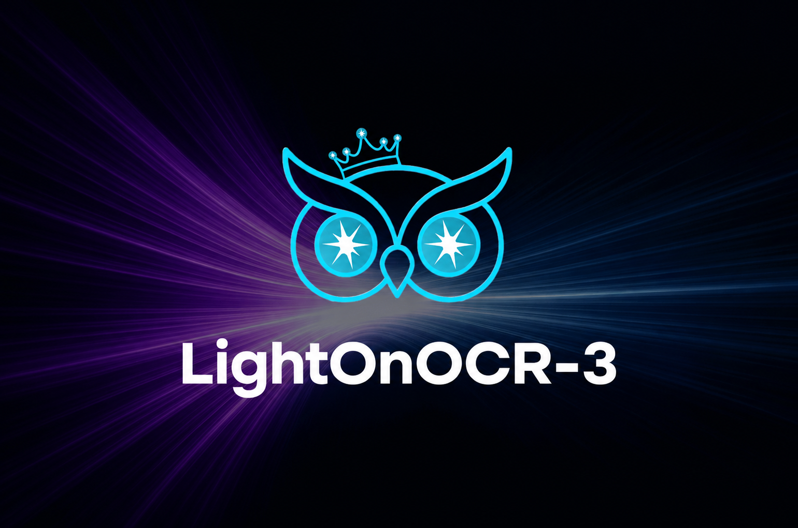
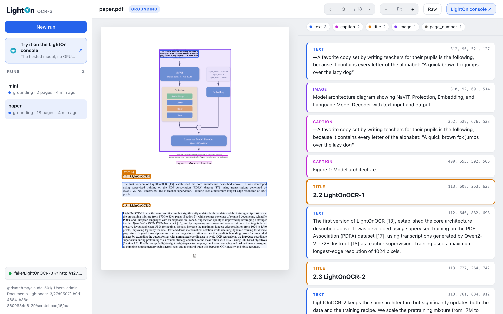

<p align="center">
  
</p>

# LightOnOCR

[](https://lighton.ai)
[](https://www.linkedin.com/company/lighton/)
[](https://x.com/LightOnIO)
[](https://huggingface.co/blog/lightonai/lightonocr-3)

A minimal client, CLI and viewer for the LightOnOCR models (versions 1, 2 and 3) served with
[vLLM](https://github.com/vllm-project/vllm), plus the code to reproduce our benchmarks
([`benchmarks/`](benchmarks)). How LightOnOCR-3 was built: [the blog post](https://huggingface.co/blog/lightonai/lightonocr-3).

> [!IMPORTANT]
> **Grounding (layout blocks with bounding boxes) works with LightOnOCR-3 only.** LightOnOCR-1 and
> LightOnOCR-2 do plain OCR only.

## Quick start

```bash
uv sync --extra vllm && source .venv/bin/activate   # client + vLLM (plain `uv sync` for the client alone)

vllm serve lightonai/LightOnOCR-3-1B \
    --limit-mm-per-prompt '{"image": 1}' --max-model-len 16384 \
    --mm-processor-cache-gb 0 --no-enable-prefix-caching --port 8010

lightonocr paper.pdf --mode grounding               # -> out/paper/
lightonocr viewer                                   # http://127.0.0.1:8000
```

The client expects the server at `http://127.0.0.1:8010/v1`; change it with `--base-url`,
`LIGHTONOCR_BASE_URL` or from the viewer.



## Models

| Model | Grounding | Page size | Extra `vllm serve` flags |
|---|---|---|---|
| [`LightOnOCR-3-0.8B`](https://huggingface.co/lightonai/LightOnOCR-3-0.8B) | ✅ | 2048 px | `--max-model-len 18000 --default-chat-template-kwargs '{"enable_thinking": false}' --mm-processor-cache-gb 0 --no-enable-prefix-caching` |
| [`LightOnOCR-3-1B`](https://huggingface.co/lightonai/LightOnOCR-3-1B) | ✅ | 1540 px | `--max-model-len 16384 --mm-processor-cache-gb 0 --no-enable-prefix-caching` |
| [`LightOnOCR-3-4B`](https://huggingface.co/lightonai/LightOnOCR-3-4B) | ✅ | 2048 px | `--max-model-len 18000 --default-chat-template-kwargs '{"enable_thinking": false}' --mm-processor-cache-gb 0 --no-enable-prefix-caching` |
| [`LightOnOCR-2-1B`](https://huggingface.co/lightonai/LightOnOCR-2-1B) | ❌ | 1540 px | `--mm-processor-cache-gb 0 --no-enable-prefix-caching` |
| [`LightOnOCR-1B-1025`](https://huggingface.co/lightonai/LightOnOCR-1B-1025) | ❌ | 1540 px | `--mm-processor-cache-gb 0 --no-enable-prefix-caching` |

Serve with `vllm serve lightonai/<model> --limit-mm-per-prompt '{"image": 1}' <flags> --port 8010`.
The client reads the model name from the server and picks the page size, sampling and modes to match.
With a custom `--served-model-name`, it assumes LightOnOCR-3 at 2048 px. `--longest-edge` overrides
the page size.

**vLLM version:** the `vllm` extra pins vLLM 0.30.0 with **transformers 5.16.1**. transformers 5.17
breaks the 1B models on vLLM 0.30.0, and vLLM 0.27.1 makes every model loop.

## Modes

A request is one user message with the page image, and nothing else:

| Mode | Prompt | Output |
|---|---|---|
| **plain** | the image | Markdown: HTML tables, LaTeX math, reading order |
| **grounding** (LightOnOCR-3 only) | the image + the word `grounding` | The same, with a `` box before every layout block |

## Command line and viewer

```bash
lightonocr paper.pdf                              # plain mode -> out/paper/
lightonocr paper.pdf --mode grounding             # LightOnOCR-3 only
lightonocr scan.png --print                       # images work too; --print echoes the output
lightonocr paper.pdf --pages 1,3-5 --name intro   # some pages, into out/intro/
lightonocr viewer --port 8080                     # browse out/ and start runs from the browser
```

Each run is a folder `out/<name>/` with one `page-NNN.png` (the image sent), `page-NNN.md` (the model
output) and, in grounding mode, `page-NNN.json` (the parsed blocks) per page. `lightonocr --help`
lists every option.

## Python

```python
from lightonocr import LightOnOCR, load_pages, to_markdown, HEADER_FOOTER

ocr = LightOnOCR()                                   # http://127.0.0.1:8010/v1
pages = load_pages("paper.pdf", ocr.profile.longest_edge)

print(ocr.plain(pages[0]))                           # markdown
blocks = ocr.grounding(pages[0])                     # LightOnOCR-3 only, else ValueError
for b in blocks:
    print(b.label, b.bbox, b.text[:60])
print(to_markdown(blocks, drop=HEADER_FOOTER))       # without headers, footers, page numbers
```

The client repairs escaped math delimiters in the output (`\$x\$` -> `$x$`, prices left alone);
`ocr.ocr(page, fix_dollars=False)` returns the model's output untouched.

Without the client, call the OpenAI-compatible endpoint directly:

```python
response = requests.post("http://127.0.0.1:8010/v1/chat/completions", json={
    "model": "lightonai/LightOnOCR-3-1B",
    "messages": [{"role": "user", "content": [
        {"type": "image_url", "image_url": {"url": "data:image/png;base64,..."}},
        {"type": "text", "text": "grounding"},       # omit for plain mode
    ]}],
    "temperature": 0.1,
    "chat_template_kwargs": {"enable_thinking": False},
})
```

## Grounding output

```
 Model architecture diagram showing NaViT, Projection, Embedding, ...
 Figure 1: Model architecture.
 ## 2.2 LightOnOCR-1
 The first version of LightOnOCR [13], established the core architecture ...
 3
```

- Coordinates are normalised to **0–1000** whatever the image size.
- A block's text runs until the next marker, so tables and lists span several lines.
- Labels: `title`, `section`, `text`, `list`, `caption`, `footnote`, `aside_text`, `header`,
  `footer`, `page_number`, `table`, `chart` (data as an HTML table), `formula`, `code`, `image`
  (a short description).
- `text+` marks a block that continues the previous one, e.g. across columns.

## Tips

- Use temperature 0.1, not greedy decoding.
- Send one image per request but many requests at once: vLLM batches them. The CLI keeps 64 pages
  in flight.

## Benchmarks

[`benchmarks/`](benchmarks) reproduces our scores on
[ParseBench](https://github.com/run-llama/ParseBench),
[olmOCR-bench](https://github.com/allenai/olmocr/tree/main/olmocr/bench) and
[fr-bench-pdf2md](https://huggingface.co/datasets/pulsia/fr-bench-pdf2md), with every version pinned.
It is a separate uv project; see [`benchmarks/README.md`](benchmarks/README.md).

## License

[Apache-2.0](LICENSE). Benchmarks, models and upstream code used in [`benchmarks/`](benchmarks)
keep their own licenses.
